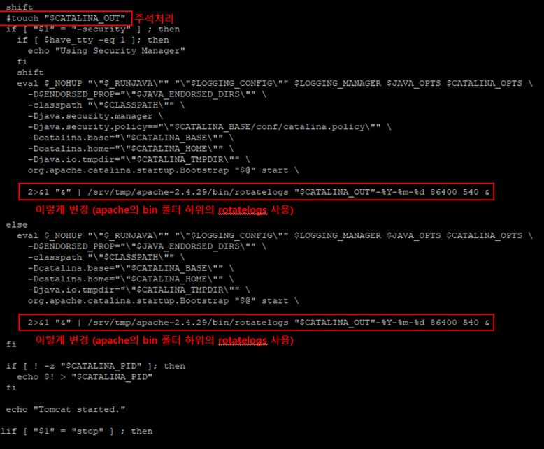

이번 시간에는 Tomcat Log에 관하여 Tuning을 해보도록 하겠습니다.
기본적으로 Tomcat log는 catalina.out 에 기록이 됩니다.

사이트를 운영하다보면 해당 catalina.out 파일 크기가 방대해지는데요.

해당 파일을 날짜별로 저장되게 변경해보도록 하겠습니다. 

---------------------------------------

1. tomcat/bin/ 하위의 catalina.sh 파일을 vi 편집기로 오픈

2. touch $CATALINA_OUT 라인을 주석처리(리눅스에서 주석처리 기호는 #)

3. 하위 사진 해당 라인에 사진과 같이 명령을 추가
  2>$1 "&" | apache/bin/rotatelogs "$CATALINA_OUT"-%Y-%m-%d 86400 540 &
  
  
  
  
4. 추가적으로 log level를 수정하고 싶다면 tomcat/conf/ 하위의 logging.properties 파일 수정 
level 은 다음과 같이 ALL, FINEST, FINER, FINE, CONFIG, INFO, WARNING, SEVERE를 지원하며 오른쪽으로 갈수록 로그량이 적다.
